# flwr

the **flwr** is the little SMD sister of [the anal0g flow3r](https://github.com/wenzellabs/anal0g_flow3r), and electrically identical except it has seven petals instead of five.

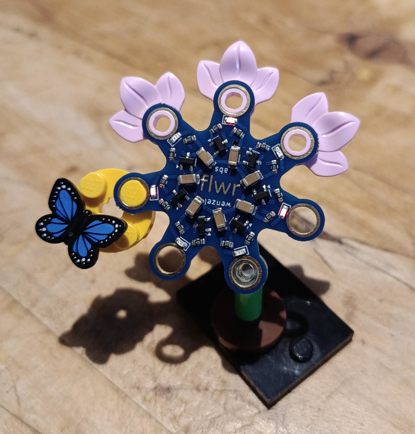

it blinks slowly and the holes in the petals are compatible with famous brick toys.

## the components are small

it's a solder kit to get into advanced SMD soldering. the smallest component size is 0603. that means 60mil by 30mil or roughly 1.5mm by 0.76mm. here's a grain of rice next to a 0603 LED and a 0603 resistor. and no, I didn't pick a specially large grain.

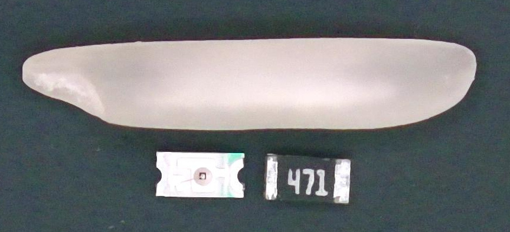

but with a steady hand and good eyes or a microscope and fine tweezers this is very much doable by hand.

## the kit

here's the kit's content:

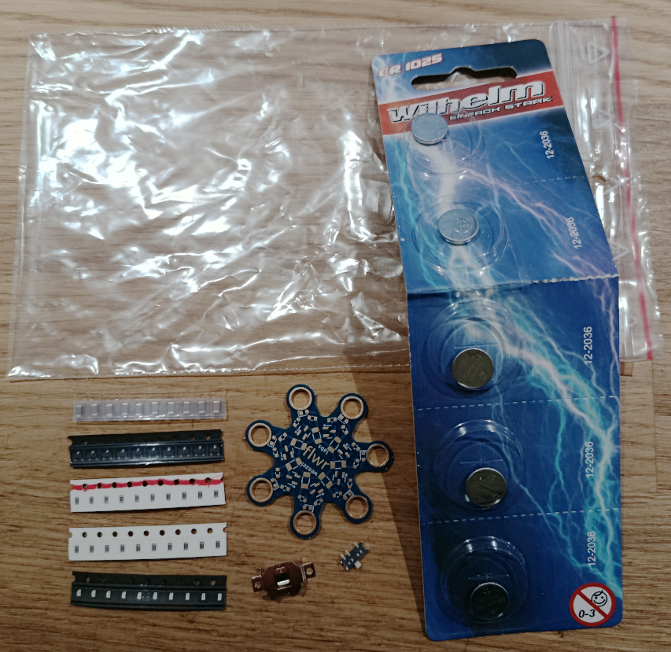

list of components:

- 7-10 pieces, capacitor, MLCC, 100uF, transparent tape, largest component
- 7-10 pieces, NPN transistor, black tape, three legs
- 7-10 pieces, resistor, 3.3kOhm, white tape, red stripe, "332"
- 7-10 pieces, resistor, 470Ohm, white tape, "471"
- 7-10 pieces, amber LED, black tape, white component
- 1 piece, flwr PCB
- 1 piece, switch
- 1 piece, battery holder
- 1 piece, one-time stencil for SMD paste and reflow soldering (didn't make it to the photo shoot)
- 5 pieces, CR1025 lithium 3V battery

## two pathes lead to the flwr

there's two basic methods of soldering that you can use to master the flwr:

**method A**: what I refer to as **hand soldering**.

**method B**: what I refer to as **paste soldering**.

## tools required

- tweezers
- mirror (to determine the LED polarity easily)

- method A, hand soldering:
    - soldering iron
    - flux
    - thin solder wire (max 0.5mm thickness)
    - soldering iron with a thin tip

- method B, paste soldering:
    - adhesive tape
    - some naked PCB leftovers, 1.6mm thickness
    - stencil
    - (low melt) solder paste
    - squeegee (some plastic card or thin steel plate)
    - hot plate or reflow oven
    - 3d printed edge align tool

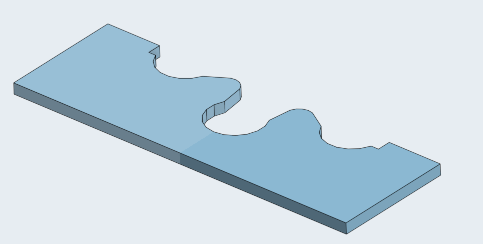

### method A: hand soldering

closer to the classic soldering of larger through-hole parts, but likely more difficult due to the tiny component size.

follow the sequence of components as outlined in the **assembly** section.

start with the innermost component and there with the innermost pad. I like to tin the seven innermost pads first, then "slide in" the seven capacitors, then solder the seven outer connections of the capacitors to their pads.

then the next innermost component, the transistor, also here tin the seven innermost pads first (transitor pad 2), then place the components, align them nicely and finish by soldering down the other two contacts.

work your way outwards. always be mindful of a relaxed hand and body posture, makes soldering so much easier. see the chapter **LED polarity** for the last and outermost top side component.

flip the board, now you're trained for the component with the smallest feature size: the switch. solder all seven connections.

last the battery holder. mind the orientation as shown in the **assembly** section. just fill the two open holes with solder.

### method B: paste soldering

closer to modern automated assembly using a stencil to print solder paste onto the PCB, placing components into the wet paste and reflow soldering using an oven or a hot plate.

use a flat clean table surface, install the PCB leftovers in corner arrangement and tape them down with the adhesive tape. place the edge alignment tool into the corner and the (first) flwr PCB. push all firmly into place, and take care nothing is loose or moves.

take the stencil and place it on the PCB. take your time to perfectly align the solder pads with the holes in the stencil. now use the adhesive tape to stick down one edge of the stencil so it can act as a hinge. fold back and forth the stencil to validate the solder pads still align properly.

smear a strip of solder paste between the hinge and the first open holes in the stencil. smear the solder paste into the holes of the stencil using the squeegee.

once all holes are fully filled with paste fold back the stencil. take out the PCB. in case you have multiple flwrs you can now repeat the paste printing process on the other PCBs. the paste won't dry out too fast.

now place all the components using tweezers.

follow the sequence of components as outlined in the **assembly** section.

## LED polarity

the LED must be placed in the correct orientation.

as shown in the pictures the anode is left, and the cathode is right.

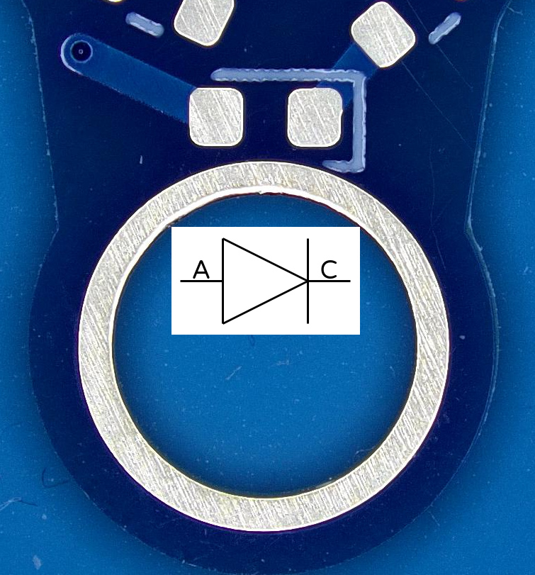

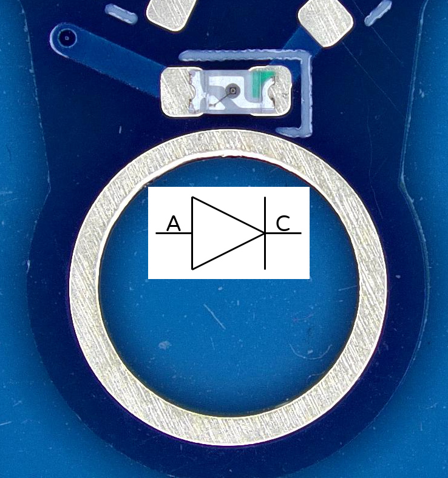

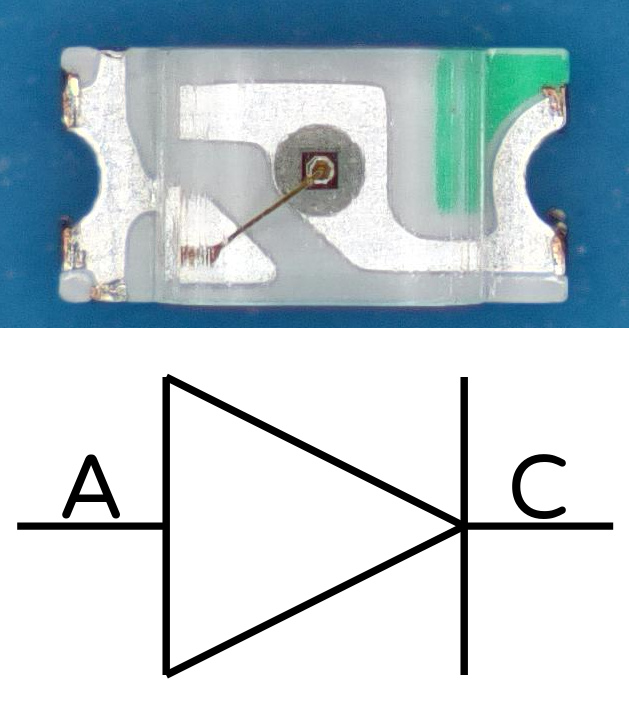

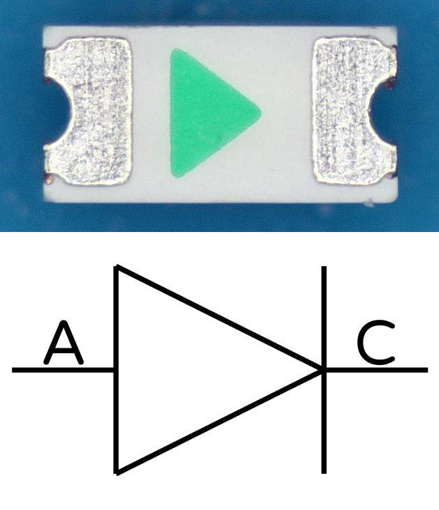

this is how the mirror helps you see the bottom marking of the LED while its orientation is correct for picking it up with a tweezer.

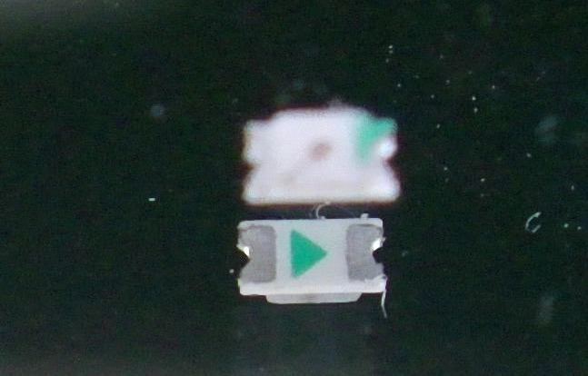

## assembly

first do the top side assembly, then bottom.

start at the center, and work your way outwards.

start with the capacitor, MLCC, 100uF, transparent tape, largest component.

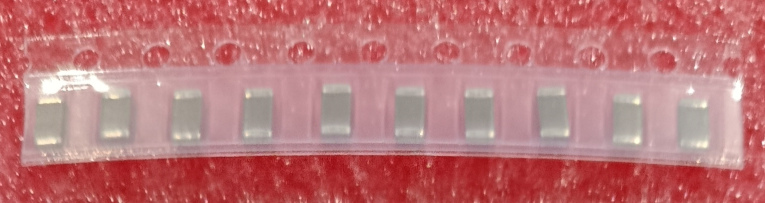

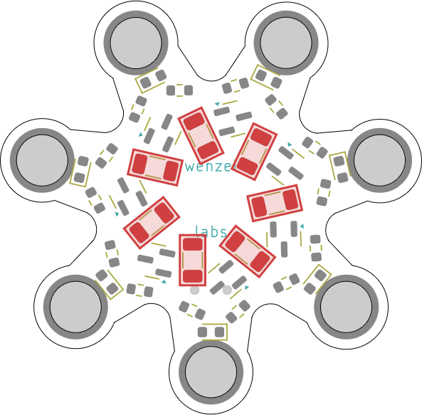

next, the NPN transistor, black tape, three legs.

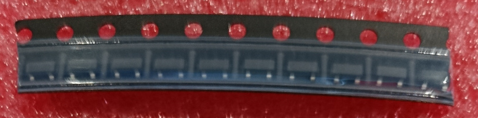

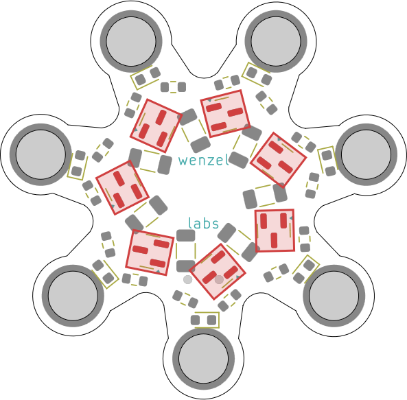

then the resistor, 3.3kOhm, white tape, red stripe, "332".

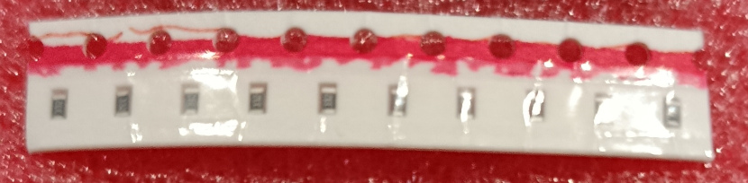

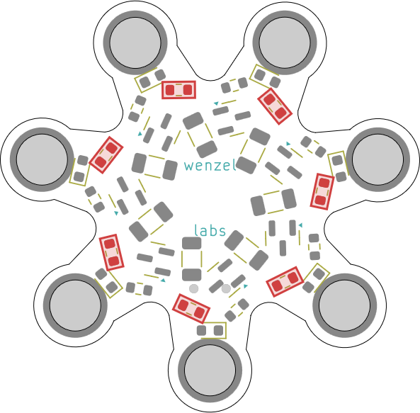

next, the resistor, 470Ohm, white tape, "471".

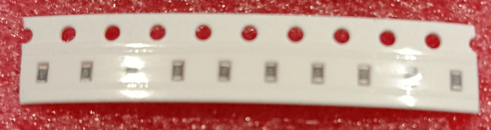

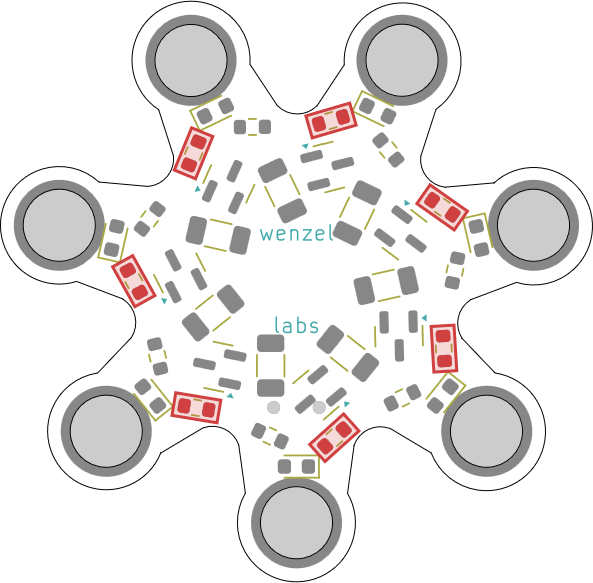

last top side part is the LED amber, black tape, white component.
use the mirror to determine the polarity easily. seat the bottom marking at the open end of the U-shaped marking around the LED.

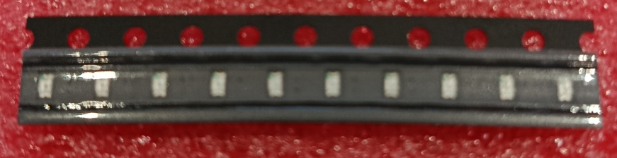

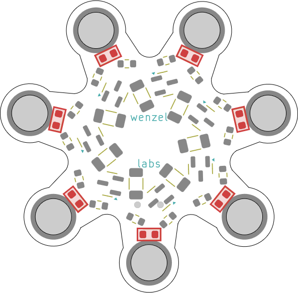

bottom side switch. mind the orientation as shown.

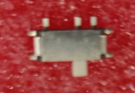

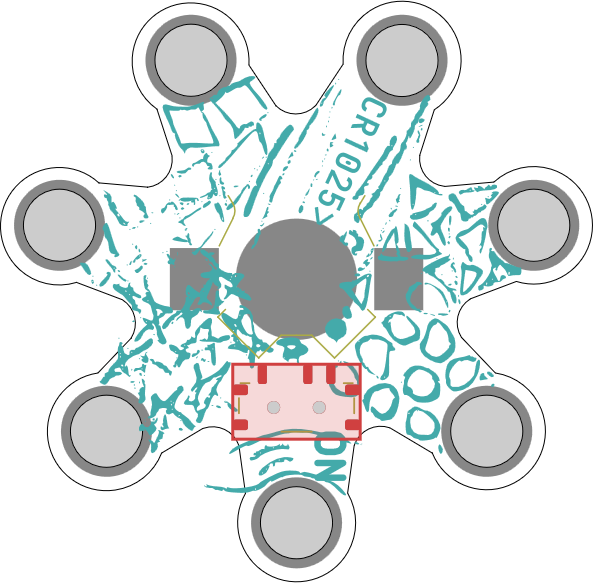

bottom side battery holder. mind the orientation as shown.

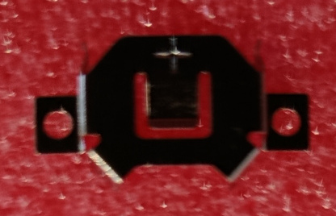

a last step before inserting the battery is to push down the top center battery tap **once** as the holder is a little on the loose side.

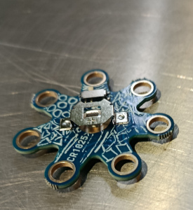
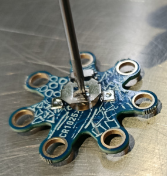
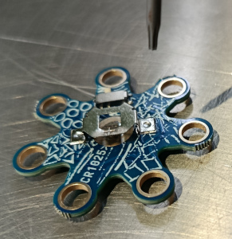

## schematics

the flwr is a ring oscillator.

made up of seven stages of analog inverters it never comes to a rest, and the light is passed on from one petal to the next.

a battery, a switch and seven of these stages:

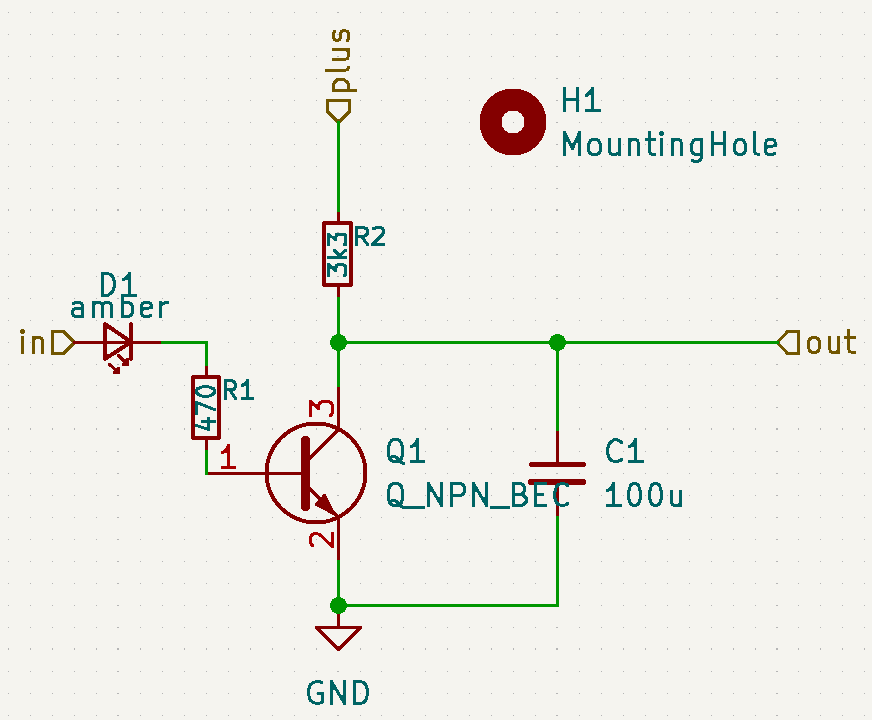

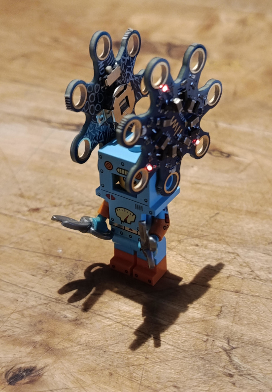 

